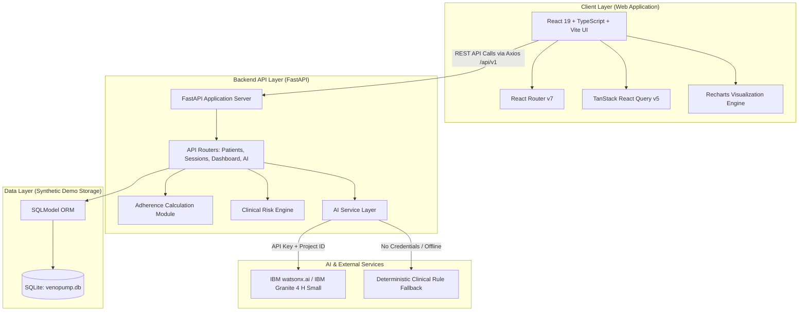

# System Architecture: Veno-Pump Clinical Monitoring Platform

> **Safety Notice:** *Decision support only — clinician judgement required. AI output does not constitute a diagnosis, treatment recommendation, or prescription.*

---

## 1. High-Level Architecture Diagram



---

## 2. Component Breakdown

| Component | Technology | Responsibility |
|---|---|---|
| **Frontend Application** | React 19, TypeScript, Vite 8, Tailwind CSS v4 | Provides the clinician-facing UI, cohort tables, patient profiles, session simulator, and AI assistant interface. |
| **State & API Client** | TanStack React Query v5, Axios | Handles asynchronous caching, optimistic updates, and REST API communication with the backend. |
| **Data Visualization** | Recharts | Renders interactive time-series outcome trajectories (pain, oedema, heaviness, fatigue) and adherence bar charts. |
| **Backend REST API** | FastAPI 0.115, Python 3.11+, Uvicorn | Manages HTTP routing, request validation via Pydantic schemas, and coordinates service calculations. |
| **Adherence Engine** | Python (`adherence.py`) | Calculates 28-day compliance ratios, session completion rates, and week-over-week adherence momentum. |
| **Clinical Risk Engine** | Python (`risk_engine.py`) | Evaluates patient records against 4 risk criteria (adherence drop, symptom worsening, incomplete sessions, high discomfort). |
| **AI Service Layer** | Python (`ai_service.py`), `ibm-watsonx-ai` SDK | Formulates grounded clinical prompts, executes inference against **IBM Granite 4 H Small**, and manages deterministic fallbacks. |
| **Database & ORM** | SQLModel (SQLAlchemy + Pydantic), SQLite | Stores synthetic patient profiles, prescribed protocols, and simulated rehabilitation session records. |
| **Hosting & Deployment** | Vercel (Frontend), Render (Backend), IBM Cloud (watsonx.ai) | Cloud deployment architecture delivering global web access and API reliability. |

---

## 3. Data Flow

### A. Patient Dashboard & Cohort Monitoring
1. The clinician opens the web dashboard at `https://veno-pump.vercel.app/`.
2. The React frontend dispatches a `GET /api/v1/dashboard/summary` request to the Render FastAPI backend.
3. The backend queries SQLModel for all active patients and their last 28 days of simulated sessions.
4. The backend computes cohort-level metrics (total active patients, high-risk count, average adherence rate) and returns a structured JSON payload.
5. The frontend renders overview stat cards, patient tables, and alert badges.

### B. Session Simulation & Real-Time Risk Recalculation
1. A clinician logs a completed or simulated rehabilitation session via `POST /api/v1/sessions`.
2. The backend records the session duration, protocol completion percentage, and reported discomfort level into `venopump.db`.
3. The backend triggers the `adherence.py` and `risk_engine.py` modules to re-evaluate the patient's updated 28-day adherence and risk tier.
4. Updated risk flags (e.g., `ADHERENCE_DROP` or `HIGH_DISCOMFORT`) are persisted and immediately reflected across the UI.

---

## 4. AI Prompting & Decision Support Flow

```
┌────────────────────────────────────────────────────────────────────────┐
│ 1. Grounded Context Assembly                                           │
│    FastAPI computes deterministic metrics:                             │
│    - 28-day adherence % & week-over-week delta                         │
│    - Baseline vs. 7-day average symptom scores (pain/swelling/etc.)   │
│    - Active clinical risk flags & session completion rates             │
└──────────────────────────────────┬─────────────────────────────────────┘
                                   │
                                   ▼
┌────────────────────────────────────────────────────────────────────────┐
│ 2. Structured Prompt Generation                                        │
│    Injects factual values into system prompt:                          │
│    - Strict clinical decision support boundaries                      │
│    - No autonomous diagnosis or prescription rules                     │
│    - Standard medical disclaimer enforcement                           │
└──────────────────────────────────┬─────────────────────────────────────┘
                                   │
                  ┌────────────────┴────────────────┐
                  ▼                                 ▼
      [ watsonx.ai Configured ]          [ Offline / No API Key ]
                  │                                 │
                  ▼                                 ▼
      ┌───────────────────────┐         ┌───────────────────────┐
      │ IBM Granite Inference │         │ Deterministic Engine  │
      │ ibm/granite-4-h-small │         │ Rule-based synthesis  │
      └───────────┬───────────┘         └───────────┬───────────┘
                  │                                 │
                  └────────────────┬────────────────┘
                                   │
                                   ▼
┌────────────────────────────────────────────────────────────────────────┐
│ 3. UI Response Rendering                                               │
│    - JSON response with model metadata and provider provenance         │
│    - Safety banner: "Decision support only — clinician judgement..."   │
└────────────────────────────────────────────────────────────────────────┘
```

---

## 5. Security & Safety Considerations

- **Synthetic Data Boundary:** All database records represent synthetic demo patients; no real Protected Health Information (PHI) or personally identifiable information (PII) is processed.
- **Environment Variable Protection:** watsonx.ai API keys, project IDs, and service URLs are read strictly from server-side environment variables and are never bundled into the client build or committed to git.
- **CORS Restriction:** FastAPI CORS middleware is restricted to designated frontend origins (`localhost:5173` in development, production Vercel domains in staging/production).
- **Medical Safety Boundaries:** Prompts and responses explicitly enforce non-diagnostic boundaries: AI outputs serve as assistive decision support and require human clinician review.

---

## 6. Scalability & Future Evolution

- **Stateless Application Server:** FastAPI backend is stateless, enabling horizontal scaling behind load balancers.
- **Database Abstraction:** SQLModel ORM provides clean schema definitions and seamless database abstraction without altering application business models.
- **Async AI Inference:** watsonx.ai inference is decoupled via HTTP/REST and SDK interfaces, supporting asynchronous queuing and batch evaluations for large patient panels.
- **Future Hardware Layer:** The architecture is designed to integrate future Veno-Pump wearable hardware by adding IoT/BLE ingestion endpoints without restructuring existing clinical decision models.
